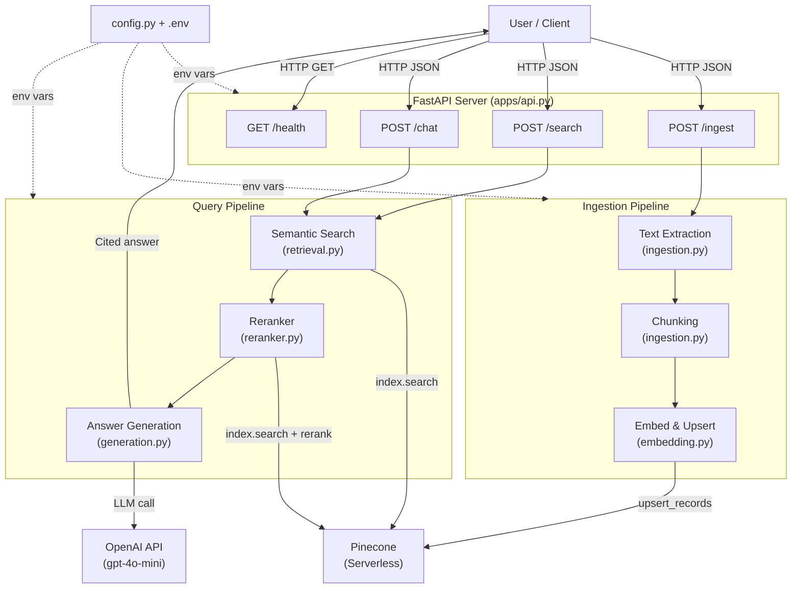
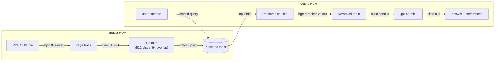

# Architecture Document: RAG Pipeline Classic

## 1. Overview

This project implements a classic Retrieval-Augmented Generation (RAG) pipeline that allows users to ingest PDF or text documents, store their embeddings in a vector database, and ask natural-language questions that are answered with inline citations grounded in the source material.

The system is exposed as a REST API built with FastAPI. It connects to two external services: **Pinecone** (vector storage, embedding, and reranking) and **OpenAI** (answer generation).

---

## 2. System Architecture

### 2.1 High-Level Component Diagram



### 2.2 Data Flow Diagram



---

## 3. Component Design and Rationale

### 3.1 Ingestion (`ingestion.py`)

**What it does:** Accepts a file path (PDF or TXT), extracts text page by page, concatenates it into a single stream, and splits it into fixed-size character chunks with overlap. Each chunk tracks which page(s) it spans.

**Key design decisions:**

| Decision | Choice | Why |
|----------|--------|-----|
| PDF library | PyPDF | Pure Python, no system dependencies (unlike pdfplumber or Tika). Handles standard PDFs well. |
| Chunking unit | Characters (not tokens) | Simpler, faster, and model-agnostic. Token-based chunking ties you to a specific tokenizer. |
| Chunk size | 512 characters | Balances between too-small chunks (lose context) and too-large chunks (dilute relevance). 512 characters roughly maps to ~100-130 tokens, which fits well within embedding model context windows. |
| Overlap | 64 characters (~12.5%) | Prevents information loss at chunk boundaries. If a key sentence spans two chunks, the overlap ensures at least one chunk contains the full sentence. |
| Page tracking | Per-character page map | Enables accurate citation. Each character in the concatenated text is mapped to its source page, so chunks spanning page boundaries list all relevant pages. |

**Tradeoffs considered:**
- **Semantic chunking** (splitting on paragraph/section boundaries) would produce more coherent chunks, but adds complexity and is hard to generalize across document formats. Fixed-size chunking with overlap is a robust default.
- **Smaller chunks** (256 chars) increase retrieval precision but reduce context per chunk, often requiring more chunks to answer a question. **Larger chunks** (1024 chars) provide more context but dilute relevance scores.

### 3.2 Embedding & Upsert (`embedding.py`)

**What it does:** Creates a Pinecone serverless index (if it doesn't exist) with an integrated embedding model, then upserts document chunks in batches.

**Key design decisions:**

| Decision | Choice | Why |
|----------|--------|-----|
| Embedding model | `multilingual-e5-large` | Pinecone's integrated model. No separate embedding API call needed — Pinecone embeds on ingest and on query. Supports 100+ languages. |
| Embedding approach | Integrated (server-side) | Eliminates a separate OpenAI/HuggingFace embedding step. Reduces latency, simplifies code, and ensures query/document embeddings use the same model. |
| Batch size | 96 records | Pinecone recommends batches of ~100 for upsert. 96 is a safe default that avoids hitting payload size limits. |
| Index type | Serverless (AWS us-east-1) | No capacity planning needed. Scales to zero when idle, scales up under load. Cost-effective for development and small-to-medium workloads. |
| Namespace | `documents` | All documents share a single namespace. Keeps the setup simple. Namespaces could be used for tenant isolation in a multi-user scenario. |

**Duplicate detection (`is_file_ingested`):**
Before upserting, the system queries Pinecone to check if any existing record has the same `source` filename. If found, the upsert is skipped. This prevents:
- Wasting embedding compute on already-ingested documents
- Creating duplicate chunks that would inflate retrieval results
- Unnecessary Pinecone write operations

**Limitation:** Duplicate detection is by filename only. If the same filename is used for a different version of the document, the new version will not be ingested. A production system would need versioning (e.g., hash-based IDs or a metadata version field).

### 3.3 Retrieval (`retrieval.py`)

**What it does:** Takes a user query, embeds it using Pinecone's integrated model, and performs approximate nearest neighbor (ANN) search to return the top-k most semantically similar chunks.

**Key design decisions:**

| Decision | Choice | Why |
|----------|--------|-----|
| Search method | Pinecone integrated search | Query embedding happens server-side, same model as document embeddings. Single API call for embed + search. |
| Top-K default | 10 | Retrieves a broad candidate set. The reranker then narrows this down to the most relevant 5. Retrieving too few (e.g., 3) risks missing relevant chunks. |
| Fields returned | `chunk_text`, `source`, `pages` | Minimum needed for answer generation and citation. |

**How embedding search works:**
1. The user's query string is sent to Pinecone
2. Pinecone embeds the query using `multilingual-e5-large` (same model used for documents)
3. Pinecone performs ANN search across all vectors in the `documents` namespace
4. The top-k results are returned, ranked by cosine similarity score

**Why semantic search over keyword search:** Semantic search understands meaning, not just exact word matches. A query like "How much revenue did Apple make?" will match chunks containing "total net sales" even though the words don't overlap. This is critical for financial documents where terminology varies.

### 3.4 Reranker (`reranker.py`)

**What it does:** Takes the same query, retrieves top-k candidates, then applies a cross-encoder reranking model to re-score and re-order the results, returning only the top-n most relevant.

**Key design decisions:**

| Decision | Choice | Why |
|----------|--------|-----|
| Rerank model | `bge-reranker-v2-m3` | High-quality cross-encoder reranker available as a Pinecone integrated model. No separate API needed. |
| Top-N default | 5 (from top-K=10) | Returns half the candidates. Aggressive enough to filter noise, permissive enough to capture relevant context. |
| Rank field | `chunk_text` | Reranks based on the actual text content, not metadata. |

**Why reranking improves results:**
- **Bi-encoder (embedding search)** encodes query and document independently. Fast but can miss nuanced relevance.
- **Cross-encoder (reranker)** processes query and document together, allowing it to model fine-grained interactions between them. Slower but significantly more accurate.
- The two-stage approach (fast retrieval + precise reranking) gives the best of both worlds: speed from the bi-encoder, accuracy from the cross-encoder.

**Example impact:** For the query "What happened to NIKE Direct revenues?", the bi-encoder might rank a chunk about "total revenues" higher than one specifically about "NIKE Direct." The cross-encoder reranker correctly prioritizes the more specific chunk.

### 3.5 Generation (`generation.py`)

**What it does:** Takes the user's question and the top-n reranked chunks, constructs a prompt with citation instructions, and calls OpenAI's GPT-4o-mini to generate a grounded, cited answer.

**Key design decisions:**

| Decision | Choice | Why |
|----------|--------|-----|
| LLM | `gpt-4o-mini` | Cost-effective, fast, and capable enough for extraction/summarization from provided context. Not doing creative generation, so a smaller model suffices. |
| Temperature | 0.2 | Low temperature for factual, deterministic answers. Higher temperatures would introduce unnecessary variation in financial data extraction. |
| Max tokens | 1024 | Sufficient for detailed answers with citations. Prevents runaway responses. |
| Prompt structure | System prompt + context block | System prompt defines behavior and citation format. Context block numbers each chunk with source/page metadata. |

**Prompt engineering — citation system:**
```
[1] (source: Apple_Q24.pdf, p.1)
 Apple Inc. CONDENSED CONSOLIDATED STATEMENTS...

[2] (source: Apple_Q24.pdf, p.2)
 Total current assets 147,957...
```

Each chunk is numbered `[1]`, `[2]`, etc. The system prompt instructs the model to:
1. Use ONLY the provided context (prevents hallucination)
2. Cite inline using `[1]`, `[2]` markers
3. Add a References section at the end with source filenames and page numbers

This design ensures every claim in the answer can be traced back to a specific page in the source document.

**Context window management:**
With 5 chunks of 512 characters each (~2,560 chars total, ~500-650 tokens), plus the system prompt (~200 tokens) and question (~20 tokens), the total input is well within GPT-4o-mini's 128K context window. This leaves ample room for the 1024-token response.

### 3.6 API Layer (`api.py`)

**What it does:** Exposes the pipeline as a REST API with four endpoints.

| Endpoint | Method | Purpose |
|----------|--------|---------|
| `/health` | GET | Liveness check |
| `/ingest` | POST | Ingest a document into the vector store |
| `/search` | POST | Retrieve relevant chunks (with optional reranking) |
| `/chat` | POST | End-to-end RAG: retrieve, rerank, generate answer |

**Key design decisions:**
- **Pydantic models** for request/response validation and automatic OpenAPI docs
- **Debug mode** on `/chat`: when `debug=true`, the response includes both the raw retrieved chunks and the reranked chunks, allowing inspection of how reranking changed the results
- **Error handling**: 404 for missing files, 400 for invalid input, 500 for internal errors
- **Swagger UI** auto-generated at `/docs` for interactive testing

---

## 4. Data Model

### 4.1 Document Record (Pinecone)

Each chunk is stored as a Pinecone record with the following fields:

| Field | Type | Example | Purpose |
|-------|------|---------|---------|
| `_id` | string | `Apple_Q24.pdf::chunk_1` | Unique ID: `{filename}::chunk_{n}` |
| `chunk_text` | string | `"Apple Inc. CONDENSED..."` | The actual text (also used as the embedding input via `field_map`) |
| `source` | string | `"Apple_Q24.pdf"` | Source filename for citation |
| `pages` | string | `"1,2"` | Comma-separated page numbers this chunk spans |

The `_id` format enables traceability: given any chunk ID, you can identify the source file and chunk position.

### 4.2 Namespace Isolation

All documents are stored in the `documents` namespace within a single Pinecone index (`rag-pipeline-classic`). This means:
- All documents are searchable together (cross-document queries work)
- A single index serves the entire application
- For multi-tenant scenarios, separate namespaces per tenant would provide isolation without additional indexes

---

## 5. Edge Cases and Error Handling

| Scenario | Handling |
|----------|----------|
| Empty PDF (no extractable text) | Pages with no text are skipped. If all pages are empty, zero chunks are produced and zero records are upserted. |
| Unsupported file type | `ValueError` raised with the file extension. API returns 400. |
| File not found | `FileNotFoundError` caught. API returns 404. |
| Duplicate document ingestion | `is_file_ingested()` checks Pinecone for existing records with the same source filename. Skips upsert if found. |
| Empty query | Retrieval and reranker return empty lists. Generation returns "I don't have enough information." |
| Pinecone index doesn't exist | On ingestion: auto-created via `create_index_for_model()`. On query: `ValueError` raised with message. |
| Missing API keys | Generation raises `ValueError` if `OPENAI_API_KEY` is not set. Pinecone operations fail with authentication errors. |
| Answer not in context | System prompt instructs the LLM to say "I don't have enough information to answer that." |

---

## 6. Configuration

All configurable parameters are centralized in `config.py`, loaded from environment variables (`.env`) and module-level constants:

```
.env                          config.py
├── OPENAI_API_KEY      ──>   OPENAI_API_KEY
├── PINECONE_API_KEY    ──>   PINECONE_API_KEY
                              CHUNK_SIZE = 512
                              CHUNK_OVERLAP = 64
                              PINECONE_INDEX_NAME = "rag-pipeline-classic"
                              PINECONE_NAMESPACE = "documents"
                              PINECONE_EMBED_MODEL = "multilingual-e5-large"
                              PINECONE_RERANK_MODEL = "bge-reranker-v2-m3"
                              TOP_K = 10
                              RERANK_TOP_N = 5
                              OPENAI_MODEL = "gpt-4o-mini"
                              MAX_TOKENS = 1024
                              TEMPERATURE = 0.2
```

Secrets (API keys) are loaded from `.env` via `python-dotenv`. The `.env` file is excluded from version control via `.gitignore`.

---

## 7. Project Structure

```
rag-pipeline-classic/
├── apps/
│   ├── __init__.py          # Package marker
│   ├── config.py            # Centralized configuration
│   ├── ingestion.py         # PDF/TXT extraction and chunking
│   ├── embedding.py         # Pinecone index management and upsert
│   ├── retrieval.py         # Semantic search over Pinecone
│   ├── reranker.py          # Cross-encoder reranking
│   ├── generation.py        # LLM answer generation with citations
│   ├── api.py               # FastAPI endpoints
│   └── testrag.py           # End-to-end pipeline test script
├── docs/
│   ├── Apple_Q24.pdf        # Sample document (Apple Q4 2024 financials)
│   ├── ARCHITECTURE.md      # This document
│   └── architecture.drawio  # Visual architecture diagram
├── pyproject.toml            # Project metadata and dependencies
├── uv.lock                   # Dependency lock file
├── .env                      # API keys (not committed)
├── .gitignore
└── README.md
```

---

## 8. Technology Choices Summary

| Component | Choice | Alternatives Considered | Why This Choice |
|-----------|--------|------------------------|-----------------|
| API framework | FastAPI | Flask, Django REST | Async-ready, automatic OpenAPI docs, Pydantic validation built-in. Best fit for a data pipeline API. |
| ASGI server | Uvicorn | Gunicorn, Hypercorn | Lightweight, fast, native async support. `--reload` for development. |
| Vector database | Pinecone Serverless | Weaviate, Qdrant, ChromaDB | Managed service, no infrastructure to maintain. Integrated embedding and reranking eliminate separate model hosting. |
| Embedding model | multilingual-e5-large | OpenAI text-embedding-3-small, Cohere embed | Integrated with Pinecone (no extra API call). Multilingual support. No per-token embedding cost. |
| Reranker | bge-reranker-v2-m3 | Cohere rerank, custom cross-encoder | Integrated with Pinecone search API. Single API call for retrieve + rerank. High accuracy on MTEB benchmarks. |
| LLM | GPT-4o-mini | GPT-4o, Claude, Llama | Cost-effective for context-grounded QA. Fast response times. Good instruction following for citation format. |
| PDF parsing | PyPDF | pdfplumber, PyMuPDF, Tika | Pure Python, no system dependencies. Handles standard text-based PDFs. |
| Config management | python-dotenv | pydantic-settings, dynaconf | Simple, well-known, minimal overhead for a small project. |
